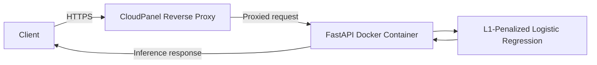

# Real-Time Corporate Fraud Inference API

A real-time inference service for assessing potential corporate fraud risk from financial data. The API is built with FastAPI and deployed as a Docker container on an Ubuntu VPS.

## Architecture

CloudPanel serves as the reverse proxy, routing incoming requests to the FastAPI container. HTTPS is provided with a Let's Encrypt SSL certificate.

## Model

The inference service uses **L1-penalized Logistic Regression**, trained on **2,012 observations** with an approximately **98:2 class ratio**. The dataset is highly imbalanced, so predictions should be interpreted with that context in mind.

A probability threshold of **0.60** is used to identify potential fraud cases. The model is intended to serve as an **early warning system**: flagged cases should be reviewed further and are not definitive findings of fraud.

## Deployment Stack

| Component | Technology |
|---|---|
| API framework | FastAPI |
| Containerization | Docker |
| Server | Ubuntu VPS |
| Reverse proxy | CloudPanel |
| SSL certificate | Let's Encrypt |

## Limitations

- The dataset's class imbalance can affect how model performance should be interpreted.
- Predictions are intended to support further investigation, not replace human judgment.
- The threshold and model performance should be reviewed as operational requirements or data characteristics change.