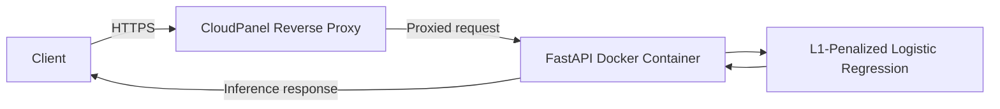

# Real-Time Corporate Fraud Inference API

A real-time inference service for assessing potential corporate fraud risk from financial data. The API is built with FastAPI and deployed as a Docker container on an Ubuntu VPS.

## Architecture



CloudPanel acts as the reverse proxy, routing incoming requests to the FastAPI container. HTTPS is secured with a Let's Encrypt SSL certificate.

## Model

The inference service uses **L1-penalized Logistic Regression**, trained on **2,012 observations** with an approximately **98:2 class ratio**. Because the dataset is highly imbalanced, predictions should be interpreted with that context in mind.

A probability threshold of **0.60** is used to identify potential fraud cases. The model is intended as an **early warning system**. Flagged cases should be reviewed further and are not definitive findings of fraud.

## Deployment Stack

| Component | Technology |
|---|---|
| API framework | FastAPI |
| Containerization | Docker |
| Server | Ubuntu VPS |
| Reverse proxy | CloudPanel |
| SSL certificate | Let's Encrypt |

## Usage

The API provides a secure REST interface for real-time inference.

### Interactive Documentation

Explore the endpoints, view the Pydantic schemas, and try requests through the Swagger UI:

[Open the API documentation](https://api.gloryatk.com/docs)

### Inference Request

**Method:** `POST`  
**Endpoint:** `https://api.gloryatk.com/predict`

Submit a JSON payload containing financial metrics and accounting indices, such as AQI, DEPI, and SGI, for the evaluated period.

#### Example Request

```bash
curl -X POST \
  'https://api.gloryatk.com/predict' \
  -H 'accept: application/json' \
  -H 'Content-Type: application/json' \
  -d '{
    "Receivables-Net(t-1)": 0,
    "Cash-Gen(t)": 0,
    "SalesGenAdmExpen - R&Dexpense(t-1)": 0,
    "Sales(t)": 0,
    "AQI": 0,
    "DEPI": 0,
    "SGI": 0,
    "DSRI": 0,
    "TATA": 0,
    "GMI": 0,
    "SGAI": 0,
    "LVGI": 0
  }'
```

## Expected JSON Response:
{
  "fraud_probability": 0.65,
  "is_flagged_for_review": true,
  "processing_time_ms": 12.4
}

## Limitations

- The dataset's class imbalance can affect how model performance should be interpreted.
- Predictions are intended to support further investigation, not replace human judgment.
- The threshold and model performance should be reviewed as operational requirements or data characteristics change.