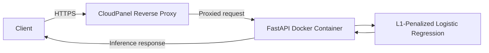

# Real-Time Corporate Fraud Inference API

A real-time inference service for assessing potential corporate fraud risk from financial data. The API is built with FastAPI and deployed as a Docker container on an Ubuntu VPS.

## Architecture



CloudPanel handles reverse proxying, and HTTPS is secured through Let's Encrypt when DNS is healthy.

## Model

The model uses L1-penalized logistic regression trained on 2,012 observations with an approximate 98:2 class ratio. Because the dataset is highly imbalanced, predictions should be interpreted with that context in mind.

A probability threshold of 0.60 is used to identify potential fraud cases. The model is intended as an early warning system. Flagged cases require further review and are not definitive findings of fraud.

## Deployment Stack

| Component | Technology |
| --- | --- |
| API framework | FastAPI |
| Containerization | Docker |
| Server | Ubuntu VPS |
| Reverse proxy | CloudPanel |
| SSL certificate | Let's Encrypt |

## Production Access Instructions

The API is live and containerized on the production server. It is currently affected by a backend DNS synchronization issue at the cloud provider level, which can cause split-brain routing and prevent automated Let's Encrypt issuance. The endpoint remains functional, but it is temporarily using a self-signed certificate. You must bypass local SSL warnings to test it.

### 1. Access the Swagger UI

1. Open https://api.gloryatk.com/docs
2. If your browser warns that the connection is not private, click Advanced and proceed.
3. If the site times out because of split-brain DNS routing, refresh the page to retry the alternate route.

### 2. Test via cURL

Use the `-k` or `--insecure` flag to skip certificate verification:

```bash
curl -k -X POST "https://api.gloryatk.com/predict" \
  -H "accept: application/json" \
  -H "Content-Type: application/json" \
  -d '{
    "Receivables-Net(t-1)": 0,
    "Cash-Gen(t)": 0,
    "SalesGenAdmExpen - R&Dexpense(t-1)": 0,
    "Sales(t)": 0,
    "AQI": 0,
    "DEPI": 0,
    "SGI": 0,
    "DSRI": 0,
    "TATA": 0,
    "GMI": 0,
    "SGAI": 0,
    "LVGI": 0
  }'
```

### Example Response

```json
{
  "fraud_probability": 0.65,
  "is_flagged_for_review": true,
  "processing_time_ms": 12.4
}
```

## Limitations

- The dataset's class imbalance can affect how model performance should be interpreted.
- Predictions are intended to support further investigation, not replace human judgment.
- The threshold and model performance should be reviewed as operational requirements or data characteristics change.
