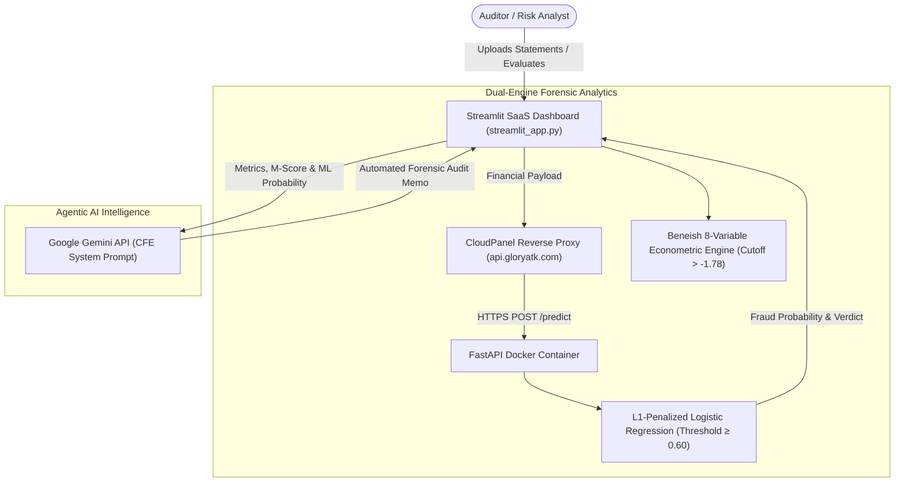

# Real-Time Corporate Fraud Inference API & SaaS Dashboard

<p align="center">
  <a href="http://localhost:8501" target="_blank">
    
  </a>
  <a href="https://api.gloryatk.com/docs" target="_blank">
    
  </a>
</p>

An end-to-end financial forensic intelligence system for detecting corporate earnings manipulation and financial statement fraud. 

Combines a **FastAPI containerized microservice** running an L1-penalized Logistic Regression model, an **8-variable Beneish M-Score econometric engine**, a **Streamlit SaaS Dashboard**, and **Agentic AI commentary powered by Google Gemini**.

---

## 🎯 Architecture



---

## 🚀 Live Demo & Step-by-Step Walkthrough

Follow these steps to launch and test the interactive Streamlit SaaS dashboard:

### Step 1: Clone & Install Dependencies

Ensure Python 3.10+ is installed, then install required packages:

```bash
pip install -r requirements.txt
```

### Step 2: (Optional) Set Google Gemini API Key

To enable automated natural language forensic commentary from Google Gemini:

```bash
# Windows PowerShell:
$env:GEMINI_API_KEY="your-gemini-api-key"

# Linux / macOS Bash:
export GEMINI_API_KEY="your-gemini-api-key"
```

> **Note:** If you don't set the environment variable, you can still type your key directly into the secure password field in the dashboard's sidebar at runtime.

### Step 3: Launch the Streamlit Dashboard

Run the following command in the project directory:

```bash
streamlit run streamlit_app.py
```

The application will open automatically in your browser at:
👉 **[http://localhost:8501](http://localhost:8501)**

---

## 🖥️ Using the Dashboard (Interactive Tour)

### 1. Configure the API Backend
* In the **sidebar**, the API endpoint is pre-configured to the live production server:
  `https://api.gloryatk.com`
* **Bypass SSL Verification** is checked by default (required due to the production server's temporary self-signed certificate).
* Click **"🔌 Ping API Health"** to verify the backend connection in real time.
* *(Optional)* If running FastAPI locally, select **"Local FastAPI (localhost:8000)"** in the dropdown.

### 2. Ingest Financial Statements
You can test the system using any of three methods:
* **One-Click Demo Data**: Click **"📥 Load Fictitious Demo Companies"** in the sidebar to load three pre-built company scenarios (Aggressive Manipulator, Clean Blue-Chip, Borderline Tech).
* **Upload Sample CSV**: Upload [`sample_financial_statements.csv`](sample_financial_statements.csv) directly via the main upload area.
* **Custom Excel/CSV**: Download the starter CSV or Excel `.xlsx` template from the sidebar, fill in your financial figures, and drag & drop it into the uploader.

### 3. Review Dual-Engine Visual Analytics
* **Fraud Probability Gauge**: Interactive Plotly gauge showing ML model probability, categorized into Low (0–30%), Moderate (30–60%), and High Risk / Flagged (60–100%) against the 60% optimal decision boundary.
* **Beneish M-Score Gauge**: Visual indicator comparing the 8-variable econometric score against the $-1.78$ threshold ($M > -1.78$ flags earnings manipulation).
* **Consensus Verdict Card**: Synthesizes both engines into an executive triage verdict (**Critical**, **Caution**, or **Clean**).
* **Ratio Breakdown Chart**: Horizontal bar chart comparing all 8 Beneish indices against normal baselines ($1.0$).
* **Color-Coded Forensic Table**: Formatted dataframe and metric cards highlighting individual anomalous indices:
  * **DSRI > 1.20**: Accelerated revenue recognition or channel stuffing
  * **AQI > 1.25**: Excessive capitalization of operating expenses
  * **GMI > 1.20**: Deteriorating gross margins
  * **TATA > 0.05**: Accounting accruals significantly outstripping operating cash flow
  * **Cash-Gen(t) < 0**: Negative cash flow despite reported profits

### 4. Generate Agentic AI Forensic Insights
* Under **"4. Agentic AI Forensic Insights"**, Gemini analyzes the company's quantitative signals through the lens of a **Certified Fraud Examiner (CFE)**.
* Produces an automated forensic memorandum detailing:
  1. Executive risk diagnosis.
  2. Forensic accounting breakdown of red-flag indices.
  3. Concrete substantive audit procedures (e.g. receivables confirmations, sales cut-off verification, deferred expense audit).

---

## 🛠️ Deployment Stack

| Component | Technology | Role |
| --- | --- | --- |
| **Front-End SaaS Dashboard** | Streamlit, Plotly, Pandas | Interactive forensic analytics UI |
| **Inference Microservice** | FastAPI, Uvicorn | Real-time REST API for model predictions |
| **Machine Learning Engine** | Scikit-Learn, Joblib | L1-Penalized Logistic Regression classifier |
| **Econometric Model** | Beneish 8-Variable Equation | Classic $-1.78$ Earnings Manipulation Index |
| **Agentic AI** | Google Gemini (`google-generativeai`) | Automated natural language forensic audit reports |
| **Containerization & Hosting** | Docker, CloudPanel, Ubuntu VPS | High-availability cloud deployment |

---

## 🌐 Production API Access (Swagger & cURL)

The FastAPI inference service is running on the live production VPS:

### 1. Interactive Swagger UI
Open [https://api.gloryatk.com/docs](https://api.gloryatk.com/docs) *(bypass the self-signed SSL warning in your browser if prompted)*.

### 2. cURL Command

```bash
curl -k -X POST "https://api.gloryatk.com/predict" \
  -H "accept: application/json" \
  -H "Content-Type: application/json" \
  -d '{
    "Receivables-Net(t-1)": 2450.0,
    "Cash-Gen(t)": -410.0,
    "SalesGenAdmExpen - R&Dexpense(t-1)": 1180.0,
    "Sales(t)": 8900.0,
    "AQI": 1.65,
    "DEPI": 1.22,
    "SGI": 1.45,
    "DSRI": 1.88,
    "TATA": 0.19,
    "GMI": 1.42,
    "SGAI": 1.18,
    "LVGI": 1.38
  }'
```

### Example API Response

```json
{
  "fraud_probability": 0.351,
  "is_fraudulent": false,
  "inference_latency_ms": 3.43
}
```

---

## ⚠️ Notes & Limitations

- **Imbalanced Dataset**: The underlying ML model was trained on 2,012 observations with an approximate 98:2 class ratio; probability outputs should be interpreted alongside the Beneish M-Score and operational cash flows.
- **Investigative Aid**: This system serves as a high-sensitivity early warning filter for auditors, forensic accountants, and compliance teams. Flagged cases warrant substantive audit review and do not constitute definitive legal proof of fraud.
- **Production SSL**: The VPS endpoint currently uses a self-signed certificate due to a cloud provider DNS synchronization delay; client applications should enable SSL bypass (`verify=False` / `-k`).
